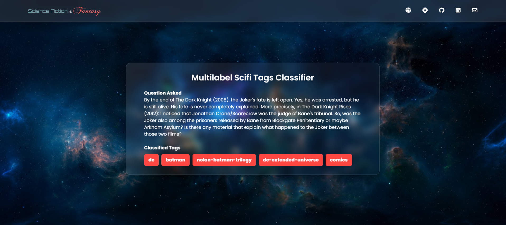

## Web Deployment

Developed a Flask Webapp and deployed to Vercel. It takes scifi and fantasy questions as input and classifies the relevant tags associated with the question via HuggingFace API. The webapp is live [here](https://multilabel-scifi-tags-classifier.vercel.app/).

1. The webapp takes scifi and fantasy questions as input:

1. It utilizes HuggingFace API to classify the relevant tags:

