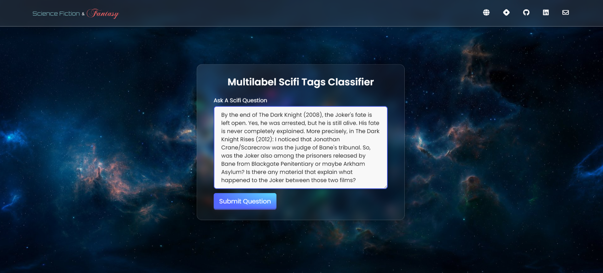

<h1 align="center">
  <br>
  <!-- <a href="http://www.amitmerchant.com/electron-markdownify"></a>
  <br> -->
  Multilabel Scifi Tags Classifier
  <br>
</h1>

<h4 align="center">Classify 160 different tags from scifi and fantasy questions.</h4>

<p align="center">
  <!-- <a href="https://badge.fury.io/js/electron-markdownify">
    
  </a>
  <a href="https://gitter.im/amitmerchant1990/electron-markdownify"></a> -->
  <!-- <a href="">
      
  </a> -->
  <a href="https://github.com/zzarif/StackExchange-Scifi-Tags-Classifier">
    
  </a>
  <a href="https://www.kaggle.com/datasets/zibranzarif/multilabel-scifi-tags-classifier-dataset">
    
  </a>
  <a href="https://multilabel-scifi-tags-classifier.vercel.app">
    
  </a>
  <a href="https://opensource.org/licenses/MIT">
    
  </a>

</p>

<p align="center">
  <a href="#-overview">Overview</a> •
  <a href="#%EF%B8%8F-data-collection">Data Collection</a> •
  <a href="#-data-preprocessing">Data Preprocessing</a> •
  <a href="#-model-training">Model Training</a> •
  <a href="#-model-compression-and-onnx-inference">Compression</a> •
  <a href="#-model-deployment">Model Deployment</a> •
  <a href="#-web-deployment">Web Deployment</a> •
  <a href="#%EF%B8%8F-build-from-source">Build from Source</a> •
  <a href="#%EF%B8%8F-contact">Contact</a>
</p>

## 📋 Overview

A multi-label text classification model from data collection, model training and deployment. The model can classify **160** different types of question tags from https://scifi.stackexchange.com. The keys of `tag_types_encoded.json` shows the list of question tags.

## 🗂️ Data Collection

Data was collected from https://scifi.stackexchange.com/questions, a part of the Stack Exchange network of Q&A sites dedicated to science fiction and fantasy topics. Some popular question tags include Star Wars, Harry Potter, Marvel, DC Comics, Star Trek, Lord of the Rings, and Game of Thrones. The data collection was divided into two steps:

1. **Question URL Scraping:** The scifi question URLs were scraped with `question_url_scraper.py` and the URLs are stored along with the question titles in `question_urls.csv` file. Scroll to [this](#run-the-selenium-scraper) section for details.
2. **Fetching Question Details:** For each of the question URL in `question_urls.csv`, the question details (title, URL, description, tags) were fetched with `fetch_question_detail.py`. The question details are stored in `question_details.csv` file. Alternatively, `question_detail_scraper.py` could be used to scrape the question details. Scroll to [this](#fetch-question-details) section for details.

In total, **30,000** scifi question details were collected.

## 🔄 Data Preprocessing

Initially, there were 2095 different question tags in the dataset. After analyzing, it was found that 1935 of them were rare tags (tags that appeared in less than 0.2% of the questions). So, the rare tags were removed. As a result, a very small portion of the questions were void of any tag at all. So those question rows were removed as well. Finally, the dataset had **160** different tags across **27,493** questions.

## 💪 Model Training

Three different models from HuggingFace Transformers were fine-tuned using Fastai and Blurr. All of the models achieved **99%+** accuracy. Following are the list of models:

1. [distilroberta-base](https://huggingface.co/distilbert/distilroberta-base)
2. [roberta-base](https://huggingface.co/FacebookAI/roberta-base)
3. [bert-base-uncased](https://huggingface.co/google-bert/bert-base-uncased)

The model training notebooks can be viewed [here](notebooks/).

## 📦 Model Compression and ONNX Inference

The trained models required a storage space between **300-500MB**. So, the models were compressed using ONNX quantization which reduced its size between **80-120MB**. Following are the key performance metrics for each of the models and their compressed version respectively:

<table>
<tr>
    <th></th>
    <th>distilroberta-base</th>
    <th>distilroberta-base (quantized)</th>
    <th>roberta-base</th>
    <th>roberta-base (quantized)</th>
    <th>bert-base-uncased</th>
    <th>bert-base-uncased (quantized)</th>
</tr>
<tr>
    <th>F1 Score (Micro)</th>
    <td>0.745</td>
    <td>0.745</td>
    <td>0.783</td>
    <td>0.782</td>
    <td>0.715</td>
    <td>0.717</td>
</tr>
<tr>
    <th>F1 Score (Macro)</th>
    <td>0.278</td>
    <td>0.277</td>
    <td>0.521</td>
    <td>0.518</td>
    <td>0.146</td>
    <td>0.15</td>
</tr>
<tr>
    <th>Size</th>
    <td>314 MB</td>
    <td>79 MB</td>
    <td>476 MB</td>
    <td>120 MB</td>
    <td>419 MB</td>
    <td>105 MB</td>
</tr>
</table>

## 🤗 Model Deployment

`distilroberta-base` (quantized) with **99.37%** accuracy was the final compressed model that was deployed to HuggingFace Spaces Gradio App. The implementation can be found in [deployment](deployment) folder or [here](https://huggingface.co/spaces/zzarif/Multilabel-Scifi-Tags-Classifier).


## 🌐 Web Deployment

Developed a Flask Webapp and deployed to Vercel. It takes scifi and fantasy questions as input and classifies the relevant tags associated with the question via HuggingFace API. The webapp is live [here](https://multilabel-scifi-tags-classifier.vercel.app/).

1. The webapp takes scifi and fantasy questions as input:



2. It utilizes HuggingFace API to classify the relevant tags:


## ⚙️ Build from Source

1. Clone the repo

```bash
git clone https://github.com/zzarif/StackExchange-Scifi-Tags-Classifier.git
```

2. Initialize and activate virtual environment

```bash
virtualenv --no-site-packages venv
source venv/Scripts/activate
```

3. Install dependencies

```bash
pip install -r requirements.txt
```

_Note: Select virtual environment interpreter from_ `Ctrl`+`Shift`+`P`

## Run the Selenium Scraper

```bash
python scraper/question_url_scraper.py
```

Wait for the script to finish (might take a few hours depending on your network bandwidth). When complete, this will generate [question_urls.csv](data/question_urls.csv) file. This file has **30,000** StackExchange Scifi question titles and URLs. Now, we need to fetch the question details (description, tags, etc.) for each of these question URLs.

## Fetch Question Details

Fetching details from **30,000** question URLs is a rather resource intensive task. To efficiently fetch the details we can either request the question details via Stack API (recommended) or we can scrape the details with selenium scraper. (There are other ways too as mentioned [here](https://stackoverflow.com/a/40017359/23817375).)

### Method 1: Request question details via [Stack API](https://api.stackexchange.com/)

This method explains how we can utilize StackExchange REST APIs to request **30,000** question details. To do so:

1. Register your v2.0 application at [Stackapps](https://stackapps.com/apps/oauth/register) to get an API key.
2. `deactivate` your active virtual environment.
3. Open your `venv/Scripts/activate` file and add this line at the end of file (replace `<your_api_key>` with the API key from Stackapps):

```bash
export STACK_API_KEY="<your_api_key>"
```

4. Activate the virtual environment again:

```bash
source venv/Scripts/activate
```

5. Now, fetch the question details via Stack API:

```bash
python stackapi/fetch_question_detail.py
```

Wait for the script to finish (might take a few hours depending on your network bandwidth). The script might get interrupted midway, because the Stack API is [throttled](https://api.stackexchange.com/docs/throttle) to max 10,000 calls per day for registered apps and it only allows for only a limited number of calls within a timeframe. In that case, simply wait and re-run the script the next day and it will resume from where it got interrupted. When complete, this will generate [question_details.csv](data/question_details.csv) file. It has the details (title, url, description, tags) of **30,000** scifi and fantasy questions from StackExchange.

### Method 2: Scrape question details via Selenium Scraper

```bash
python scraper/question_detail_scraper.py
```

This method scrapes question details using `selenium` and `multiprocessing`. This is how the scraping is done:

1. The script reads the [question_urls.csv](data/question_urls.csv) file containing the question URLs.
2. It divides the URLs into chunks based on the number of CPU cores available.
3. For each chunk, it creates a separate process to scrape the question details concurrently.
4. Each process uses `selenium` to navigate to each question URL, scrape the title, description, and tags, and store the data in a list.
5. After scraping all the questions in a chunk, the process saves the data as a CSV file specific to that chunk.
6. The script waits for all processes to finish before terminating.

When complete, we have to merge all the chunk specific CSV files into one [question_details.csv](data/question_details.csv) file. By utilizing `multiprocessing`, the script can scrape multiple question details simultaneously, improving the overall efficiency of the scraping process. However, this method is, often times, not reliable due to SE's screen-scraping guidelines as mentioned [here](https://meta.stackexchange.com/a/446) and poses the potential risk of IP range ban.


## ✉️ Contact

[](https://www.linkedin.com/in/zibran-zarif-amio-b82717263/) [](mailto:zibran.zarif.amio@gmail.com)
